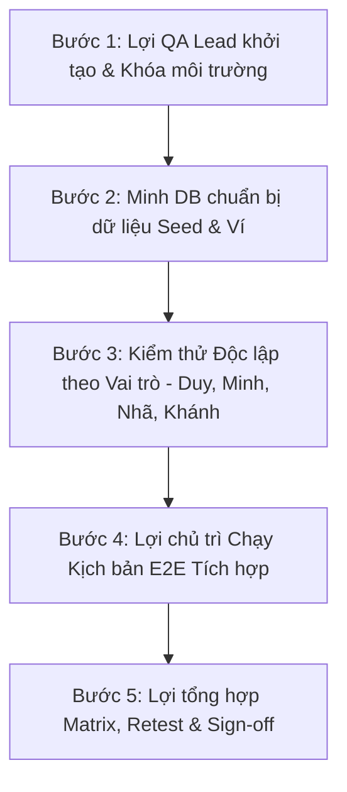

# Phân công & Lộ trình Kiểm thử MyCTU BUS (Nhóm 5 người)

**Căn cứ:** [Kịch bản kiểm thử Admin, User và Driver](QA_KICH_BAN_ADMIN_USER_DRIVER_2026-09-24.md)  
**Mục tiêu:** Kiểm thử toàn diện theo vai trò, xác minh an toàn dữ liệu/trạng thái và nghiệm thu luồng E2E thực tế trên dữ liệu thật.  
**Phiên bản Build nghiệm thu (Build SHA):** `3a23866` (Backend FastAPI, Admin Web React, Flutter App)  
**Ngày cập nhật:** 2026-09-24  

---

## 1. Danh sách Phân công theo Thành viên

| Thành viên | Vai trò & Trách nhiệm chính | Case kiểm thử phụ trách | Đầu ra nghiệm thu bắt buộc |
|---|---|---|---|
| **Thành viên 1 — Duy (Routing & Admin Portal)** | - Kiểm thử Admin Portal UI (`RouteGenerator`, `Vehicles`, `Users`, `Incidents`). - Chạy tác vụ sinh tuyến tự động (Sweep + Tabu Search). - Poll theo dõi trạng thái Job. - Xem danh sách lộ trình, kiểm tra Manifest trạm dừng. - Thực hiện **Duyệt (`Approve`)** hoặc **Từ chối (`Reject`)** tuyến xe. | ADM-01…09, ADM-11…13; Phối hợp ADM-03/06 & E2E-01 | - Snapshots/Screenshots giao diện Admin Web. - Danh sách Job IDs, Route IDs đã khởi tạo. - Nhật ký duyệt/từ chối tuyến. - Báo cáo defect giao diện Admin (nếu có). |
| **Thành viên 2 — Minh (DB, Ví điện tử & Supabase)** | - Chuẩn bị và làm sạch dữ liệu seed (Tài khoản U1/U2, D1/D2, Danh sách Xe, Trạm Depot/Pickup, Vé mẫu). - Quản lý độc quyền việc reset DB giữa các lượt test E2E. - Đối soát biến động số dư Ví điện tử (Wallet Ledger) và trạng thái Vé (`RESERVED` → `PAID_PENDING_ROUTE` → `ASSIGNED` → `USED` / `REFUNDED`). - Kiểm tra RLS và cô lập dữ liệu người dùng. | USR-03…08, USR-11; Phối hợp ADM-04/06, AUD-01, E2E-04 | - Bảng dữ liệu mẫu (đã che thông tin nhạy cảm). - SQL Đối soát số dư ví & trạng thái vé trước/sau test. - Xác nhận DB không bị nhiễm data rác. - Báo cáo defect DB/RLS/Migration. |
| **Thành viên 3 — Nhã (Backend API & Security)** | - Kiểm thử trực tiếp REST API (Swagger/Postman/Curl). - Xác minh RBAC JWT Auth cho 3 vai trò (Passenger, Driver, Admin). - Kiểm tra tính hợp lệ của State Machine (`start`/`end` route, `approve`/`reject` route). - Kiểm tra tính nguyên tử (Atomicity), Idempotency (chống double-click/retry). - Kiểm tra quy tắc xác thực QR Code (chặn QR hardcode, chặn vé sai tài xế, chặn vé chưa phân tuyến). | ADM-02/10; ADM-05; USR-04/05/07; DRV-04/08/09; E2E-03/04 | - Log Request/Response API (đã che token/secret). - Bảng mã phản hồi HTTP Status Code (200, 202, 400, 403, 409, 422). - Báo cáo defect API/RBAC/State machine. |
| **Thành viên 4 — Khánh (Flutter User & Driver App)** | - Kiểm thử ứng dụng Flutter trên thiết bị thật (Android APK / Web client). - Luồng Sinh viên: Đặt vé, chọn trạm đón, xem vé, hủy vé, hiển thị ví. - Luồng Tài xế: Đăng nhập, xem tuyến được gán, Bật/Tắt ca (Trigger `startRoute`/`endRoute`), phát GPS 15s/lần, Quét camera QR điểm danh. - Kiểm tra xử lý lỗi mạng, quyền GPS/Camera và giao diện UX. | USR-01/02/09/10; DRV-01…07, DRV-10…12; Phối hợp USR-03/06, DRV-08 | - Video/Ảnh màn hình kiểm thử trên thiết bị thật. - Nhật ký quét QR và phát GPS vị trí xe. - Phân biệt chính xác lỗi UX App vs lỗi Backend API. - Báo cáo defect Flutter App. |
| **Thành viên 5 — Lợi (QA Lead & Tích hợp E2E)** | - Tổng chỉ huy đợt kiểm thử nghiệm thu E2E. - Cấp phát Build SHA chuẩn (`3a23866`), môi trường test và tài khoản test. - Điều phối thứ tự bàn giao công việc giữa 5 thành viên. - Trực tiếp chủ trì chạy kịch bản E2E liên vai trò. - Retest các defect đã fix và quản lý bảng `qa_test_matrix_e2e.md`. - Ra quyết định Sign-off chất lượng Release. | E2E-01…04; Điều phối toàn bộ test run | - File cập nhật `qa_test_matrix_e2e.md` với đầy đủ trạng thái `PASS`/`FAIL` và Evidence. - Defect Log phân loại theo Severity & Owner. - Biên bản Tổng kết Nghiệm thu E2E (Sign-off Report). |

---

## 2. Trạng thái Cổng phụ thuộc Kỹ thuật (Dependency Gates Status)

> [!NOTE]
> **THÔNG BÁO QUAN TRỌNG:** Tất cả các tính năng sửa lỗi P0/P1 cốt lõi **ĐÃ HOÀN THÀNH & DEPLOY TRÊN BUILD `3a23866`**. Tất cả các cổng kiểm thử ĐÃ ĐƯỢC MỞ (UNBLOCKED). Nhóm tiến hành chạy test đầy đủ theo đúng kế hoạch bên dưới.

1. **Cổng Admin JWT Generate (`POST /routes/admin/generate`):** Đã mở. Admin tạo job bằng JWT Admin, không cần `X-Cron-Secret`.
2. **Cổng Job Status Polling (`GET /routes/jobs/{job_id}`):** Đã mở. UI Admin poll trạng thái job chuẩn từ `QUEUED` → `RUNNING` → `SUCCEEDED`/`FAILED`.
3. **Cổng Duyệt/Từ chối Lộ trình (`approve`/`reject`):** Đã mở. Tuyến xe hỗ trợ trạng thái `approved` / `rejected` kèm audit trail.
4. **Cổng Bắt đầu/Kết thúc tuyến Tài xế (`start`/`end`):** Đã mở. Tài xế gọi `PATCH /routes/{id}/start` và `/end` có kiểm tra ownership vehicle.
5. **Cổng Siết chặt QR Code Verification:** Đã mở. Đã xóa QR demo hardcode, chặn điểm danh vé chưa phân tuyến hoặc vé thuộc tài xế khác.
6. **Cổng Cô lập Dữ liệu Tài xế (Driver Data Leak Fix):** Đã mở. `fetchDriverRoutes` không còn lộ tuyến của tài xế khác khi `vehicle_id` rỗng.

---

## 3. Thứ tự Làm việc Chi tiết (Step-by-Step Execution Order)

Đợt kiểm thử nghiệm thu được thực hiện theo đúng **5 bước tuần tự** dưới đây:

### 🔹 BƯỚC 1: Khởi tạo đợt test & Khóa môi trường (Chủ trì: Lợi - QA Lead)
- **Hành động:** 
  1. Lợi công bố Build SHA chính thức: **`3a23866`** trên môi trường Staging.
  2. Lợi cấp phát danh sách tài khoản test (Admin `admin@ctu.edu.vn`, Sinh viên `U1`, `U2`, Tài xế `D1`, `D2`) và ma trận test case cho 4 thành viên.
  3. Thông báo chính thức mở đợt Test Run.

### 🔹 BƯỚC 2: Chuẩn bị & Chốt Dữ liệu Seed (Chủ trì: Minh - DB)
- **Hành động:** 
  1. Minh thực hiện reset database Staging về trạng thái sạch (Clean State).
  2. Minh chạy script seed dữ liệu chuẩn: 5 trạm xe buýt, 2 xe buýt (`V1` gán cho `D1`, `V2` gán cho `D2`), cấp số dư ví mặc định (200,000 VNĐ) cho `U1` và `U2`.
  3. Minh bàn giao danh sách UUID (User IDs, Vehicle IDs, Location IDs) cho Duy, Nhã, Khánh và Lợi.

### 🔹 BƯỚC 3: Kiểm thử Độc lập theo Vai trò (Chạy song song)
Tất cả 4 thành viên tiến hành test các case độc lập được phân công:

- **Thực thi 3.1 — Duy (Admin Portal UI & Routing):**
  - Mở Admin Web, tạo tác vụ sinh tuyến cho Ngày test / Ca test bằng `POST /routes/admin/generate`.
  - Kiểm tra giao diện poll trạng thái Job đến `SUCCEEDED`.
  - Xem danh sách lộ trình vừa sinh, kiểm tra Manifest trạm dừng và thứ tự đón.
  - Thử nghiệm nút **Duyệt (`Approve`)** cho Route 1 và **Từ chối (`Reject`)** cho Route 2 (nhập lý do).
- **Thực thi 3.2 — Minh (Đối soát DB & Ví):**
  - Thực hiện các lệnh truy vấn DB kiểm tra bảng `wallets`, `wallet_transactions`, `tickets`.
  - Phối hợp với Khánh khi `U1` đặt vé để đối soát trừ đúng 7,000 VNĐ và hoàn tiền đúng 7,000 VNĐ khi hủy vé.
  - Kiểm tra chính sách RLS ngăn `U1` đọc vé/ví của `U2`.
- **Thực thi 3.3 — Nhã (Backend API & Security):**
  - Dùng Swagger/Postman test API RBAC: Sinh viên gọi API Admin -> Trả `403`; Tài xế A gọi `startRoute` của xe Tài xế B -> Trả `403`.
  - Test Idempotency: Bấm `startRoute` 2 lần liên tiếp -> Trả kết quả hợp lệ, không lỗi 500.
  - Test QR Verify API: Gửi QR code chưa gán tuyến (`RESERVED`) -> Trả lỗi `400` rõ ràng.
- **Thực thi 3.4 — Khánh (App Flutter Sinh viên & Tài xế):**
  - Trải nghiệm App Sinh viên: Đăng nhập `U1`, đặt vé thành công, xem mã QR vé, thử hủy vé trước 22:00.
  - Trải nghiệm App Tài xế: Đăng nhập `D1`, bấm **Bật ca** (kiểm tra app gọi `startRoute` làm route đổi sang `in_progress`), kiểm tra thông báo phát GPS 15s/lần.
  - Quét thử mã QR bằng camera trên App Tài xế.

### 🔹 BƯỚC 4: Chạy Kịch bản E2E Tích hợp Liên vai trò (Chủ trì: Lợi - QA Lead)
Lợi điều phối 4 thành viên phối hợp chạy luồng E2E xuyên suốt từ đầu đến cuối theo đúng chu trình vận hành thực tế:

1. **Chặng 1 (Đặt vé):** Khánh (App Sinh viên `U1`) tiến hành mua 1 vé đưa đón cho ngày chạy D+1. Minh đối soát DB xem vé có status `PAID_PENDING_ROUTE` và ví bị trừ 7,000 VNĐ.
2. **Chặng 2 (Sinh tuyến & Duyệt):** Duy (Admin Portal) bấm Khởi tạo Tuyến tự động cho ngày D+1. Solver chạy thành công phân bổ vé của `U1` vào Route CT-01 gán cho xe `V1` (`D1`). Duy kiểm tra Manifest và bấm **Duyệt (`Approve`)**.
3. **Chặng 3 (Nhận tuyến & Khởi hành):** Khánh (App Tài xế `D1`) đăng nhập, thấy Route CT-01 được gán. `D1` bấm **Bật ca** → Backend chuyển tuyến sang `in_progress`, ứng dụng bắt đầu phát tọa độ GPS.
4. **Chặng 4 (Điểm danh QR):** Khánh (App Tài xế `D1`) mở camera quét mã QR trên điện thoại của `U1`. Backend xác nhận hợp lệ, đổi trạng thái vé sang `USED`. Quét lại lần 2 báo "Vé đã sử dụng".
5. **Chặng 5 (Kết thúc chuyến):** Khánh (`D1`) bấm **Tắt ca** → Backend chuyển tuyến sang `completed`, dừng phát GPS. Minh đối soát DB xác nhận tất cả trạng thái dữ liệu đều hoàn hảo.

### 🔹 BƯỚC 5: Tổng hợp Matrix, Retest & Sign-off (Chủ trì: Lợi - QA Lead)
- **Hành động:** 
  1. Tất cả 4 thành viên gửi kết quả test + Evidence (ảnh/video/log) cho Lợi.
  2. Nếu phát hiện lỗi (Defect), Lợi ghi nhận vào Defect Log, gán Owner (Duy, Minh, Nhã hoặc Khánh) sửa ngay.
  3. Sau khi dev fix xong, Lợi tiến hành Retest trên Build SHA mới.
  4. Lợi cập nhật toàn bộ trạng thái vào `qa_test_matrix_e2e.md`, xác nhận `PASS` và phát hành **Biên bản Sign-off nghiệm thu E2E**.

---

## 4. Quy tắc Phối hợp & An toàn Dữ liệu

1. **Khóa dữ liệu Seed:** Minh là người duy nhất thực hiện thao tác reset DB. Trước khi reset phải thông báo trên kênh chat nhóm.
2. **Bảo mật Credentials:** Không đưa Bearer Token, JWT Secret, Password, Cron Secret hoặc Ảnh chụp mã QR thật vào các tài liệu/ảnh báo cáo công khai.
3. **Không công nhận PASS giả:** Mọi case `PASS` đều phải có bằng chứng Evidence (Status Code `200/202`, Ảnh màn hình app thật, hoặc Log DB). Không công nhận PASS dựa trên dữ liệu giả lập (mock).
4. **Đồng bộ SHA:** Tất cả 5 thành viên phải khẳng định đang kiểm thử trên đúng phiên bản Build SHA `3a23866`.

---

## 5. Bảng Điều phối Nhanh & Trách nhiệm Ký duyệt

| Nhóm chức năng | Người thực thi chính (Owner) | Người kiểm tra đối chiếu | Trách nhiệm Ký duyệt (Sign-off) |
|---|---|---|---|
| **Admin Portal & Routing Solver** | **Duy** (Admin/Routing) | Nhã (API) + Minh (DB) | **Lợi (QA Lead)** |
| **User, Vé & Ví điện tử** | **Minh** (DB) | Khánh (App UI) + Nhã (API/RLS) | **Lợi (QA Lead)** |
| **Driver, GPS & QR Code Scanner** | **Khánh** (App Driver) | Nhã (API Security) + Minh (DB) | **Lợi (QA Lead)** |
| **RBAC Security & State Machine** | **Nhã** (Backend) | Duy (Admin) + Khánh (App UI) | **Lợi (QA Lead)** |
| **Tổng thể Kịch bản E2E & Release** | **Lợi** (Điều phối chung) | Cả 4 thành viên cùng xác nhận | **Lợi (QA Lead)** |
