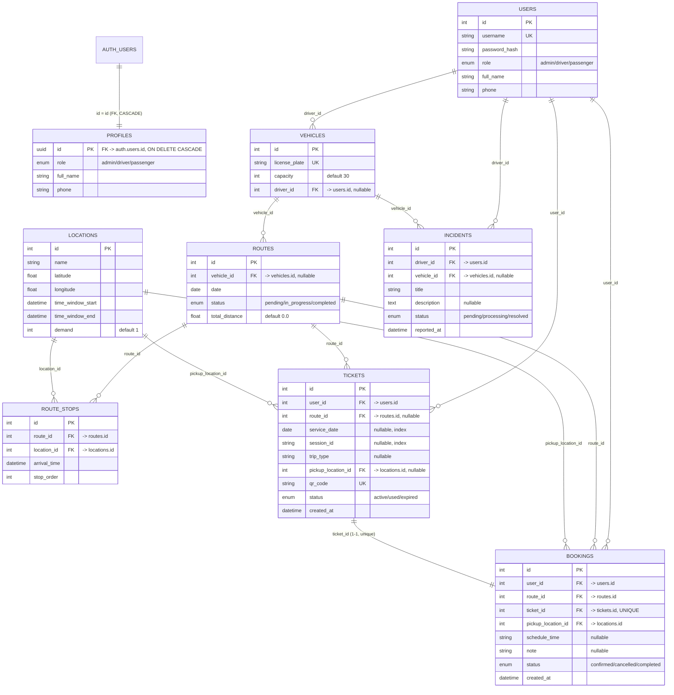

# ERD — MyCTU BUS (cập nhật sau migration `20260828_profiles_baseline`)

> **Trạng thái Ngày 1:** `profiles` đã tạo, FK → `auth.users.id` (UUID), migration đã chạy thành công. Toàn bộ 6 model nghiệp vụ (`users`, `tickets`, `bookings`, `routes`, `route_stops`, `locations`, `vehicles`, `incidents`) đã đối chiếu trực tiếp với code thật — ERD dưới đây phản ánh đúng schema hiện tại trong repo.
>
> **Chưa đổi ở Ngày 1 (theo đúng phân công):** tất cả FK người dùng (`user_id`, `driver_id`) trong `tickets`, `bookings`, `routes`, `vehicles`, `incidents` **vẫn là `Integer` trỏ về `users.id`**, chưa chuyển sang `uuid` trỏ về `profiles.id`. Việc này thuộc Ngày 4 (Thành viên 1, phối hợp Minh).
>
> ⚠️ **Cảnh báo kỹ thuật cần xử lý trước Ngày 4:** `alembic/env.py` hiện chỉ import `User, Location, Vehicle, Route, RouteStop` — **chưa import `Ticket`, `Booking`, `Incident`**. Nếu chạy `alembic revision --autogenerate` ở trạng thái này, Alembic sẽ không thấy 3 bảng này thuộc `target_metadata` và có thể sinh migration `DROP TABLE` nhầm. Cần thêm import trước khi bất kỳ ai autogenerate migration tiếp theo.

---

## Sơ đồ quan hệ (Mermaid)

---

## Chi tiết từng bảng

### `auth.users` — do Supabase quản lý, không migrate bằng Alembic
Bảng hệ thống của Supabase Auth. `profiles.id` tham chiếu trực tiếp `id` của bảng này.

### `profiles` — ✅ mới, tạo ở migration `20260828_profiles_baseline`
| Cột | Kiểu | Ghi chú |
|---|---|---|
| `id` | `uuid` (PK) | FK → `auth.users.id`, `ON DELETE CASCADE`. Định danh chuẩn duy nhất từ nay. |
| `role` | enum `profile_role` (`admin`/`driver`/`passenger`) | default `passenger` |
| `full_name` | `varchar(100)` | nullable |
| `phone` | `varchar(20)` | nullable |

### `users` — ⚠️ legacy, giữ tạm tới Ngày 3–4
| Cột | Kiểu | Ghi chú |
|---|---|---|
| `id` | `Integer` (PK) | Toàn bộ FK nghiệp vụ hiện tại (`tickets.user_id`, `bookings.user_id`, `routes` gián tiếp qua `vehicles.driver_id`, `incidents.driver_id`) đều đang trỏ vào đây |
| `username` | `varchar(50)` unique | thuộc auth nội bộ cũ, dự kiến bỏ ở Ngày 3 |
| `password_hash` | `varchar(255)` | thuộc auth nội bộ cũ, dự kiến bỏ ở Ngày 3 |
| `role` | enum `UserRole` | trùng ý nghĩa với `profiles.role`, sẽ hợp nhất |
| `full_name`, `phone` | | trùng cấu trúc `profiles` |

### `locations`
| Cột | Kiểu | Ghi chú |
|---|---|---|
| `id` | Integer PK | |
| `name` | `varchar(100)` | required |
| `latitude`, `longitude` | Float | required — tọa độ trạm |
| `time_window_start`, `time_window_end` | DateTime | nullable — dùng cho bài toán routing (Sweep/Tabu) |
| `demand` | Integer | default 1 — số lượng khách dự kiến tại trạm, input cho thuật toán sinh tuyến |

### `vehicles`
| Cột | Kiểu | Ghi chú |
|---|---|---|
| `id` | Integer PK | |
| `license_plate` | `varchar(20)` unique | |
| `capacity` | Integer | default 30 |
| `driver_id` | Integer FK → `users.id` | nullable — **ứng viên đổi UUID → `profiles.id` ở Ngày 4** |

### `routes`
| Cột | Kiểu | Ghi chú |
|---|---|---|
| `id` | Integer PK | |
| `vehicle_id` | Integer FK → `vehicles.id` | nullable |
| `date` | Date | required |
| `status` | enum `RouteStatus` (`pending`/`in_progress`/`completed`) | |
| `total_distance` | Float | default 0.0 |

⚠️ Lưu ý: `routes` **chưa có** `service_date`/`session_id`/`trip_type` như plan mô tả (*"Job sinh tuyến có `service_date + session_id + trip_type` unique"*) — hiện chỉ có cột `date` đơn thuần, chưa có unique constraint chống trùng job. Đây là việc cần bổ sung, dự kiến thuộc Ngày 4–5 (Minh + Thành viên 3 phối hợp) khi làm idempotent cho route generation job.

### `route_stops`
| Cột | Kiểu | Ghi chú |
|---|---|---|
| `id` | Integer PK | |
| `route_id` | Integer FK → `routes.id` | required |
| `location_id` | Integer FK → `locations.id` | required |
| `arrival_time` | DateTime | nullable |
| `stop_order` | Integer | required — thứ tự trạm trong tuyến |

### `tickets`
| Cột | Kiểu | Ghi chú |
|---|---|---|
| `id` | Integer PK | |
| `user_id` | Integer FK → `users.id` | required — **ứng viên đổi UUID Ngày 4** |
| `route_id` | Integer FK → `routes.id` | nullable — vé chưa gán tuyến (trước 22:00) sẽ null |
| `service_date` | Date | nullable, index |
| `session_id` | String | nullable, index |
| `trip_type` | String | nullable |
| `pickup_location_id` | Integer FK → `locations.id` | nullable |
| `qr_code` | String unique | required, index — dùng cho check-in |
| `status` | enum `TicketStatus` (`active`/`used`/`expired`) | |
| `created_at` | DateTime | default `utcnow` |

⚠️ Chưa thấy state `reserved/assigned/checked_in/cancelled` như mô tả trong plan (mục "Vé của tôi") — hiện enum chỉ có `active/used/expired`, có thể cần mở rộng ở Ngày 4 tùy cách Thành viên 4 (Flutter) map UI.

### `bookings`
| Cột | Kiểu | Ghi chú |
|---|---|---|
| `id` | Integer PK | |
| `user_id` | Integer FK → `users.id` | required — **ứng viên đổi UUID Ngày 4** |
| `route_id` | Integer FK → `routes.id` | required |
| `ticket_id` | Integer FK → `tickets.id`, **unique** | required — quan hệ 1-1 với `tickets` |
| `pickup_location_id` | Integer FK → `locations.id` | required |
| `schedule_time` | String | nullable — lưu ý: đang là String tự do, không phải DateTime chuẩn |
| `note` | String | nullable |
| `status` | enum `BookingStatus` (`confirmed`/`cancelled`/`completed`) | |
| `created_at` | DateTime | default `utcnow` |

### `incidents`
| Cột | Kiểu | Ghi chú |
|---|---|---|
| `id` | Integer PK | |
| `driver_id` | Integer FK → `users.id` | required — **ứng viên đổi UUID Ngày 4** |
| `vehicle_id` | Integer FK → `vehicles.id` | nullable |
| `title` | String | required |
| `description` | Text | nullable |
| `status` | enum `IncidentStatus` (`pending`/`processing`/`resolved`) | |
| `reported_at` | DateTime | default `utcnow` |

---

## Việc còn lại liên quan ERD (không làm ở Ngày 1, ghi chú để không quên)

1. **Sửa `alembic/env.py`**: thêm import `Ticket`, `Booking`, `Incident` — bắt buộc trước khi ai đó chạy autogenerate lần tới.
2. **Ngày 4** — đổi toàn bộ `user_id`/`driver_id` (Integer → uuid, trỏ `profiles.id`) tại: `tickets`, `bookings`, `vehicles.driver_id`, `incidents.driver_id`.
3. **Ngày 4–5** — thêm unique constraint `(service_date, session_id, trip_type)` cho `routes` để job sinh tuyến idempotent như plan yêu cầu.
4. **Cần Product Owner/leader xác nhận** — enum `TicketStatus` có cần mở rộng thành `reserved/assigned/checked_in/expired/cancelled` để khớp UI "Vé của tôi" hay giữ nguyên `active/used/expired` và map ở tầng API.

